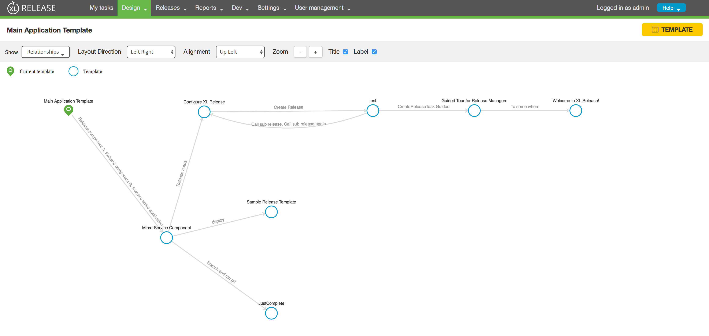
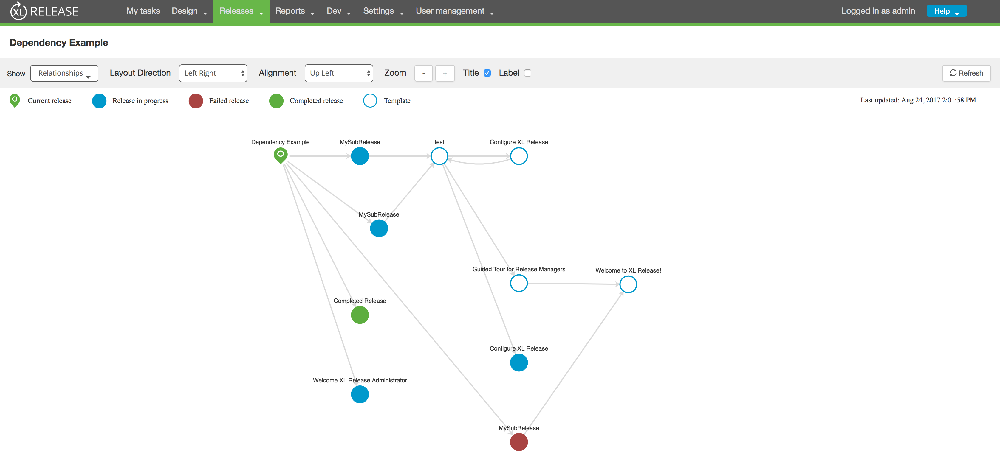

# DEPRECATTED!  
# This feature has been incorporated into the main product as of XL Release 7.5.

This repository will not be maintained.

# XL Release Relationship Visualization Plugin

[](https://opensource.org/licenses/MIT)
[](https://travis-ci.org/xebialabs-community/xlr-relationships-visualization-plugin)
[](https://www.codacy.com/app/ravan/xlr-relationships-visualization-plugin?utm_source=github.com&amp;utm_medium=referral&amp;utm_content=xebialabs-community/xlr-relationships-visualization-plugin&amp;utm_campaign=Badge_Grade)
## Overview ##


XL Release offers outstanding capabilities for pipeline composition and execution. This plugin extends those capabilities
with the ability to visualize and navigate the relationships amongst pipelines.

  
## Features ##

* Visualize release and template relationships in their design and runtime states.
* Navigate to target release or template
    * Double click to view target tasks in table view.
    * Shift + Double click to go to target's relationship view.
* Zoom with mouse wheel or toolbar controls.
* Show/Hide release titles and relationship labels.
* Layout
    * Automatic with direction and alignment toolbar controls
    * Manual by dragging and dropping node

### Design time view


### Runtime time view


## Requirements ##

* **XL Release Server** 7+
		

## Installation ##


Plugin can be downloaded directly from the plugin's repository on [Github](https://github.com/xebialabs-community/xlr-relationships-visualization-plugin/releases).

Place the plugin's **jar** file in the __&lt;xlr-home&gt;/plugins__ directory. 

## Usage ##

When working with releases or templates, you will find an additional option called **`Relationships`** in the drop down menu.


The plugin will analyse all **`xlrelease.CreateReleaseTask`** and **`xlrelease.GateTask`** tasks in the current release/template and its targets to build up the relationship graph.
Currently references to release-as-code (xfile) script tasks are not supported.

## Development ##

This plugin is built using Node.js, Webpack and Gradle.
Execute `./gradlew clean build` in the project root to build.

### Setup development XL Release Server ###

You can setup your local development XL Release Server to point to the compiled build by modifying the classpath variable, `XL_RELEASE_SERVER_CLASSPATH`, in `<xlr-home>/bin/run.sh` 

Example :

```
DEV_HOME="/Users/ravan/labs/repos/xebialabs-community/xlr-relationship-visualization-plugin"
DEV_SERVER_CLASSPATH="${DEV_HOME}/build/app:${DEV_HOME}/src/main/resources/:${DEV_HOME}/src/main/jython/"
XL_RELEASE_SERVER_CLASSPATH="${DEV_SERVER_CLASSPATH}:${classpath_dirs}"

#XL_RELEASE_SERVER_CLASSPATH="${classpath_dirs}"
```

### Live Update ###

Once you've started the development XLR server, you can execute `npm run watch` in the project root.  Now everytime you edit the source, it will be automatically compiled and your browser automatically refreshed to reflect the changes.

